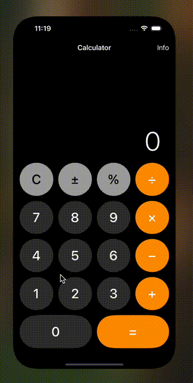
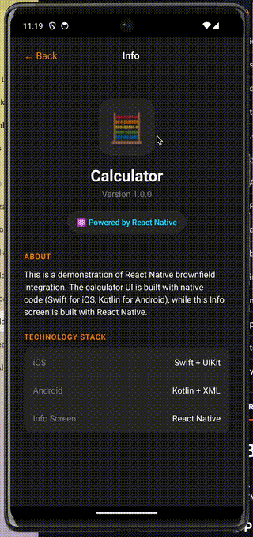

# Brownfield Calculator App

A monorepo demonstrating React Native brownfield integration with native iOS (Swift/UIKit) and Android (Kotlin) calculator apps.

## Demo

| iOS | Android |
|-----|---------|
|  |  |

## Project Structure

```
brownfield/
├── ios/
│   ├── BrownfieldCalculator/         # Main RN app
│   └── ReactBrownfield/              # Framework for brownfield integration
├── test-apps/
│   ├── ios/Calculator/               # Native iOS Calculator (Swift/UIKit)
│   └── android/Calculator/           # Native Android Calculator (Kotlin)
├── src/
│   └── screens/InfoScreen.tsx        # React Native Info screen
├── scripts/
│   ├── build-xcframework.sh          # Build iOS framework
│   ├── build-calculator.sh           # Build iOS Calculator
│   └── run-calculator.sh             # Run iOS Calculator
└── package.json
```

## Prerequisites

- Node.js >= 18.0.0
- Yarn
- Xcode 15+ (for iOS)
- Android Studio / Android SDK (for Android)
- CocoaPods

## Getting Started

### 1. Install Dependencies

```bash
yarn install
```

### 2. Install iOS Pods

```bash
cd ios && pod install && cd ..
```

---

## iOS Calculator

### Quick Start

```bash
# 1. Start Metro bundler (in separate terminal)
yarn start

# 2. Build the ReactBrownfield.xcframework
./scripts/build-xcframework.sh

# 3. Build and run Calculator
./scripts/build-calculator.sh
./scripts/run-calculator.sh
```

### Manual Steps

1. Build the ReactBrownfield framework:
   ```bash
   ./scripts/build-xcframework.sh
   ```

2. Open Calculator in Xcode:
   ```bash
   open test-apps/ios/Calculator/Calculator.xcodeproj
   ```

3. Build and run on simulator (Cmd+R)

4. In the Calculator app, tap the **Info** button in the top-right corner to navigate to the React Native screen

5. Tap **← Back** to return to the native Calculator

---

## Android Calculator

### Quick Start

```bash
# 1. Start Metro bundler (in separate terminal)
yarn start

# 2. Build and install Calculator
cd test-apps/android/Calculator
./gradlew assembleDebug installDebug

# 3. Launch the app
adb shell am start -n com.brownfield.calculator/.MainActivity
```

### Manual Steps

1. Open Android Studio and import `test-apps/android/Calculator`

2. Wait for Gradle sync to complete

3. Run on emulator or device (Shift+F10)

4. In the Calculator app, tap the **Info** button in the toolbar to navigate to the React Native screen

5. Tap **← Back** to return to the native Calculator

### Note on Android

The Android app bundles the JS code during build, so Metro bundler is not required at runtime. However, you need Metro running if you modify the React Native code and want to rebuild.

---

## How It Works

### iOS

- **ReactBrownfield.xcframework** - A framework containing React Native runtime and the `ReactBrownfieldRootViewManager` for loading RN views
- The native Calculator embeds this framework and uses it to present the Info screen
- Communication from RN to native (dismiss) uses the `ReactNativeBridge` native module

### Android

- React Native is integrated using standard `ReactApplication` and `ReactActivity`
- `SoLoader.init(this, OpenSourceMergedSoMapping)` is critical for loading native libs in RN 0.76+
- JS bundle is embedded in the APK assets
- Communication from RN to native uses the `ReactNativeBridge` native module

---

## Troubleshooting

### iOS: "No such module 'ReactBrownfield'"
Run `./scripts/build-xcframework.sh` first to build the framework.

### Android: App crashes on Info button
Make sure the JS bundle is built. Run `./gradlew clean assembleDebug` to rebuild.

### Android: "library not found" errors
Ensure you're using `SoLoader.init(this, OpenSourceMergedSoMapping)` in the Application class.

---

## License

MIT
